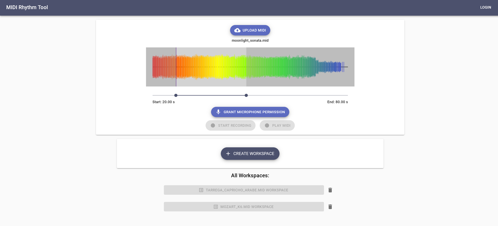
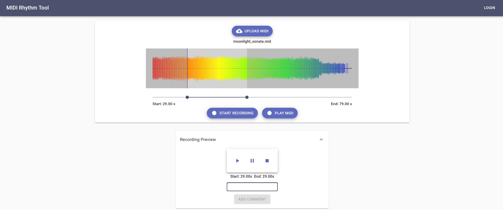
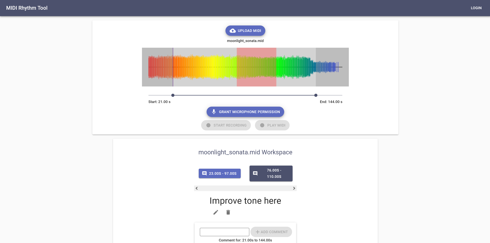

# MIDI & Microphone Rhythm Tool

A PWA (Progresive Web App) to practice playing instruments alongside a MIDI file using their device microphone. Built using [React](https://reactjs.org/), [Go](https://golang.org/), [Gin](https://github.com/gin-gonic/gin), and [PostgreSQL](https://www.postgresql.org/). Visuals made using the [Canvas API](https://developer.mozilla.org/en-US/docs/Web/API/Canvas_API), and [MidiPlayerJS](https://github.com/grimmdude/MidiPlayerJS) + [Soundfont Player](https://github.com/danigb/soundfont-player) used for MIDI playback. 

Users can record themselves playing alongside selected sections of a MIDI file. After recording, a playback of both the MIDI and microphone recording can be used to determine any mistakes and/or improvements needed. As a PWA, the application can be installled for offline use on mobile or desktop. 

Live Demo URL: https://midi-and-microphone-rhythm-practice.netlify.app/



Workspaces can be created for each individiual MIDI files where comments can be marked in specific time range. Users can progress either locally or on their Google accounts through Google Sign-In. 






## Running the project

Front-end: 
```
$ cd client
$ npm start
```

Back-end: 
```
$ cd server
$ npx nodemon
```

- Rename the env.template file in both ./client and ./server to .env and fill them out accordingly

